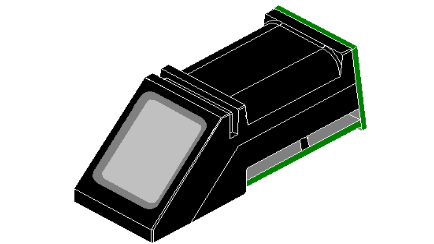

> Open this page at [https://devegied.github.io/pxt-fingerprint-as608/](https://devegied.github.io/pxt-fingerprint-as608/)

# Fingerprint scanner
Makecode extension for Fingerprint scanner based on AS608 chip.



I think there are several scanners based on AS608 chip with different firmware and they support different command sets. I got mine from [AliExpress](https://www.aliexpress.com/wholesale?catId=0&SearchText=FPM10A) for 5.5€ and it supports relatively wide command set.

Scanner also works with [Adafruit libraries](https://learn.adafruit.com/adafruit-optical-fingerprint-sensor/) but after a lot of searching on Google for "光学指纹模块 用户手册" (*Optical Fingerprint Module User Manual* in Chinese) I found PDF document with `AutoLogin` and `AutoSearch` commands which combines 7 and 3 basic commands respectively and makes this device more accessible to beginners.

## Using fingerprint scanner with micro:bit
**Important**: Acording to [micro:bit hardware specifications](https://tech.microbit.org/hardware/powersupply/) when v1 board is powered over USB it can provide only 90mA current for connected devices.
Peek current usage of fingerprint scanner based on AS608 chip can reach 130mA and that means it can not be safely used with v1 board powered over USB.
micro:bit v2 board can provide up to 270mA current for external devices when powered over USB and it can be safely used with fingerprint scanner.

## Use as Extension
In your micro:bit [Makecode](https://makecode.microbit.org/) project click on **Extensions** under the gearwheel menu or in toolbox,
search for `devegied/pxt-fingerprint-as608` and import it.

## Simple API
```package
FingerprintAS608=github:devegied/pxt-fingerprint-as608
```
```sig
FingerprintAS608.onEvent(FingerprintAS608.ScannerEvents.Any, () => {})
```
Execute commands when scanner error event occurs
  - event to be checked, eg: FingerprintAS608.ScannerEvents.CommunicationError
  - handler code to run when the event is raised

```sig
FingerprintAS608.init(SerialPin.P1, SerialPin.P2, FingerprintAS608.InitCmds.VerifyPasswordAndBacklightOff)
```
Connect to fingerprint scanner on indicated pins and execute selected commands
  - txpin micro:bit pin where scanner RX pin is connected, eg: SerialPin.P1
  - rxpin micro:bit pin where scanner TX pin is connected, eg: SerialPin.P2
  - doCommands operations done after connection is established, eg: FingerprintAS608.InitCmds.VerifyPasswordAndBacklightOff

```sig
FingerprintAS608.setLight(true)
```
Turn scanner backlight on or off
  - state scanner backlight state, eg: true

```sig
FingerprintAS608.getTemplateCount()
```
Get number of fingerprint templates stored in the scanner
  - returns number of fingerprint templates stored in the scanner

```sig
FingerprintAS608.getTemplatePos()
```
Get storage positions of fingerprint templates in the scanner
  - returns array of fingerprint template positions in the scanner

```sig
FingerprintAS608.autoEnroll(1)
```
Automaticaly get 2 fingerprint scans, convert them to characteristics, make template from them and save it to permanent storage
  - position of permanent storage to store template, eg: 1
  - returns true if template stored, false on error

The best results can be obtained when scanner backlight is turened off. Then on execution of this command:
  - backlight turns on when scanner is waiting for first scan of the finger
  - user should put the finger on the scanner
  - backlight turns off when first scan is complete
  - user should remove finger from the scanner
  - backlight turns on again when scanner is waiting for second scan of the same finger
  - user should put the finger on the scanner
  - backlight turns off when second scan is complete

```sig
FingerprintAS608.delTempl(1)
```
Delete template from permanent storage
  - position of permanent storage to delete from, eg: 1
  - returns true if template deleted, false on error

```sig
FingerprintAS608.autoSearch()
```
Does automatic search for matching stored template (scans fingerprint, creates characteristic, searches for match in stored templates)
  - returns stored template position if match found, negative integer on error or no match

The best results can be obtained when scanner backlight is turened off. Then on execution of this command:
  - backlight turns on when scanner is waiting for the finger
  - user should put the finger on the scanner
  - backlight turns off when scan is complete

## Advanced API
```sig
FingerprintAS608.genImg()
```
Immediately detects finger and stores finger image in ImageBuffer
  - returns true if finger image stored, false on error

```sig
FingerprintAS608.img2Tz(FingerprintAS608.Slots.CharBuffer1)
```
Generates characteristic file from scanned fingerprint in ImageBuffer
  - slot to store generated file, eg: FingerprintAS608.Slots.CharBuffer1
  - returns true if file generated and stored, false on error

```sig
FingerprintAS608.regModel()
```
Generates template from two stored characteristics
  - returns true if template generated and stored, false on error

```sig
FingerprintAS608.store(1)
```
Saves template to permanent storage
  - position of permanent storage to store template
  - returns true if template stored, false on error

```sig
FingerprintAS608.search(FingerprintAS608.Slots.CharBuffer1)
```
Searches for matching stored template to the generated characteristic
  - slot to compare to
  - returns stored template position if match found, negative integer on error or no match

```sig
FingerprintAS608.fastSearch(FingerprintAS608.Slots.CharBuffer1)
```
Performs high speed search for matching stored template to the generated characteristic
  - slot to compare to
  - returns stored template position if match found, negative integer on error or no match

```sig
FingerprintAS608.commScanner([0x50])
```
Sends command and data to scanner and returns its answer as a Buffer
  - cmdAndData command and data to send as number array
  - returns scanner answer packet as a Buffer

```sig
FingerprintAS608.fingerprintResp()
```
Returns last scanner answer packet as a Buffer

```sig
FingerprintAS608.getParameter(FingerprintAS608.ScannerParameters.librarySize)
```
Returns one of scanner system parameters value:
  - Status register
  - System identifier code
  - Finger templates library size
  - Security level
  - Device address
  - Maximum data packet size code
  - Serial connection baud rate code


## Blocks preview
This image shows the blocks code from the last commit in master.
This image may take a few minutes to refresh.


```cards
FingerprintAS608.init(SerialPin.P1, SerialPin.P2, FingerprintAS608.InitCmds.VerifyPasswordAndBacklightOff)
FingerprintAS608.onEvent(FingerprintAS608.ScannerEvents.Any, () => {

})
FingerprintAS608.autoEnroll(1)
FingerprintAS608.autoSearch()

FingerprintAS608.setLight(false)
FingerprintAS608.getTemplateCount()
FingerprintAS608.getTemplatePos()
FingerprintAS608.genImg()
FingerprintAS608.img2Tz(FingerprintAS608.Slots.CharBuffer1)
FingerprintAS608.regModel()
FingerprintAS608.store(2)
FingerprintAS608.delTempl(2)
FingerprintAS608.search(FingerprintAS608.Slots.CharBuffer1)
FingerprintAS608.fastSearch(FingerprintAS608.Slots.CharBuffer1)
FingerprintAS608.commScanner([0x50])
FingerprintAS608.fingerprintResp()
FingerprintAS608.getParameter(FingerprintAS608.ScannerParameters.librarySize)
```

## License  

Licensed under the MIT License (MIT). See LICENSE file for more details.

Copyright (c) 2023, devegied

#### Metadata (used for search, rendering)

* for PXT/microbit

<script src="https://devegied.github.io/makecode-devegied-gh-pages-embed.js"></script><script>makeCodeRender("{{ site.makecode.home_url }}", "{{ site.github.owner_name }}/{{ site.github.repository_name }}");</script>